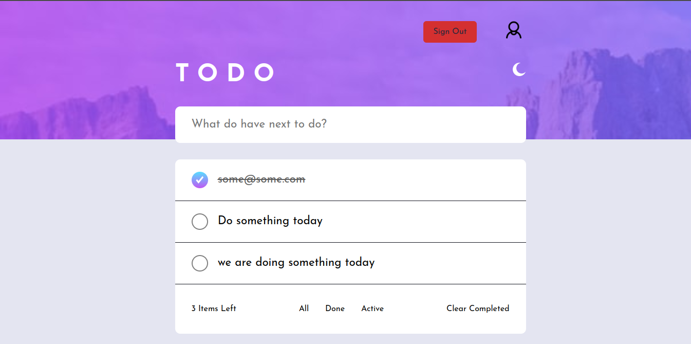
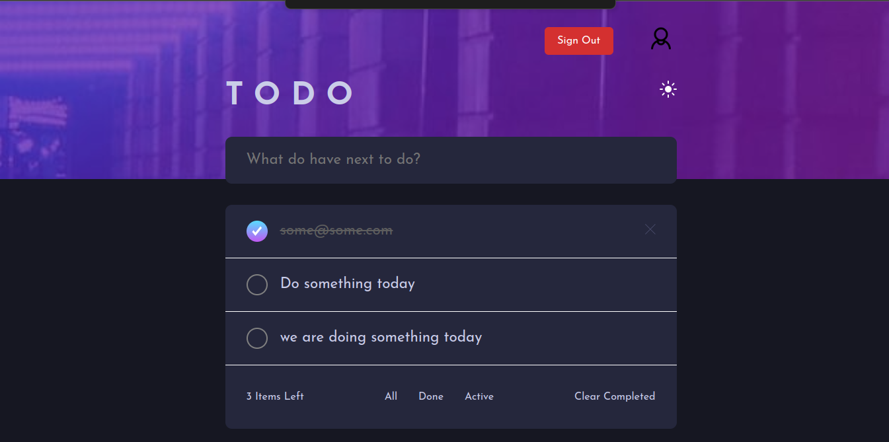
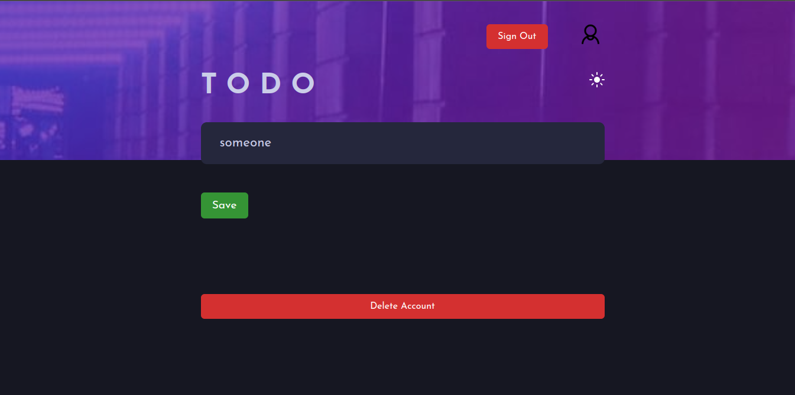
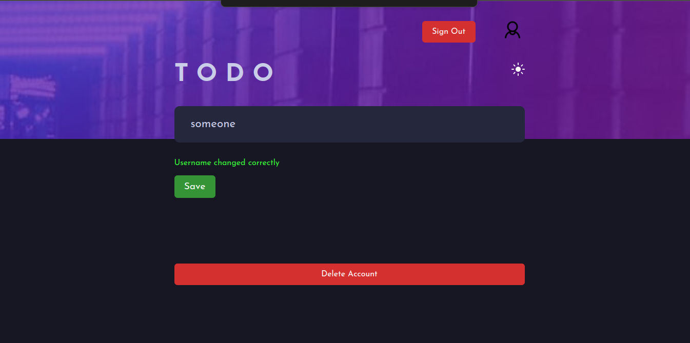
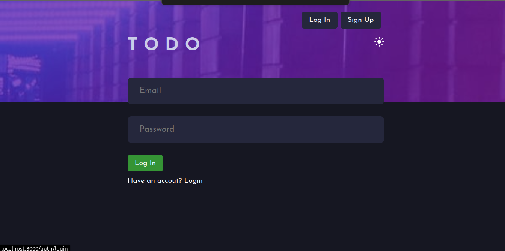
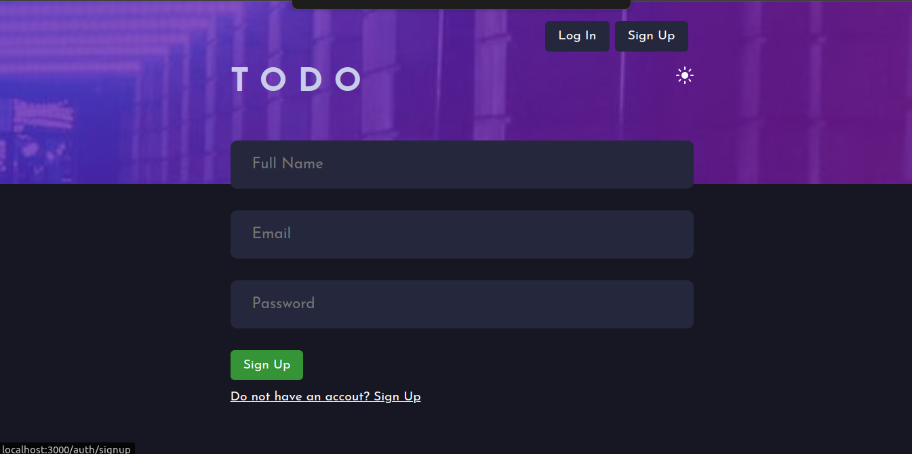
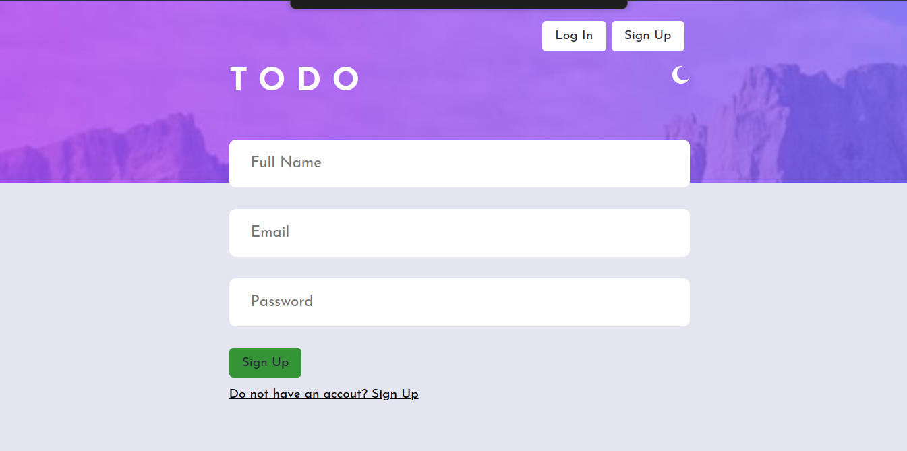
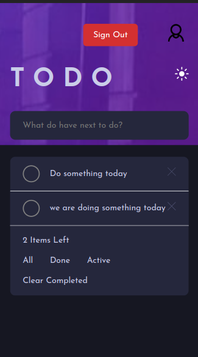
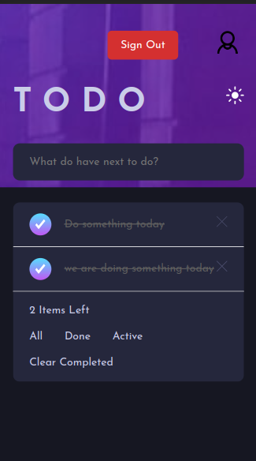

# A simple Todo Application

<!-- ## [Live website link](https://hamza-todos-app-frontend.netlify.app/) -->

### A full-stack web app to handle basic CRUD operations

### REST APIs using Node.js and Express.js and hosted it on Glitch

### The UI with React.js and hosted it on Netlify

## How the frontend looks like.

